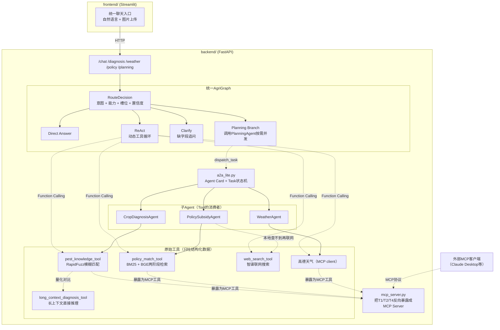

# 🌾 智慧农事助手 AgriAgent

> 面向小农户与家庭农场的多 Agent 农事决策助手：把病虫害诊断、天气判断和补贴政策匹配整合成一份有优先级的行动建议。

AgriAgent 以聊天作为唯一用户入口：先用结构化输出识别执行路线、所需能力和农业字段，再根据问题进入直接回答、ReAct 工具循环、调用原有 `PlanningAgent` 的规划分支或追问节点。用户只需自然表达需求，缺失字段由系统在多轮对话中补齐。

> 项目定位是技术验证与决策辅助，不替代农技人员的现场诊断；涉及用药和政策申报时，应以当地主管部门的最新要求为准。

## 30 秒了解项目

| 维度 | 实现 |
|---|---|
| 用户入口 | 统一聊天入口、作物图片、多轮追问补齐信息 |
| Agent 范式 | LangGraph 混合工作流：结构化路由 + ReAct + Planning 分支 |
| 政策检索 | BM25 粗筛 → 地区硬过滤 → BGE 语义精排 → 规则加权解释 |
| 病虫害诊断 | 77 条知识库，RapidFuzz 主路线 + 长上下文对照路线 |
| 协作协议 | MCP 双向实践 + A2A-lite Agent Card / Task 状态机 |
| 工程保障 | 429 重试、工具轮数上限、会话恢复、失败隔离、调用轨迹 |
| 服务形态 | FastAPI 后端 + Streamlit 前端，HTTP 分离部署 |

典型问题：

- “我在长沙种水稻，最近适合打药吗？”——自动查询天气并生成农事建议。
- “江苏种小麦能申请哪些补贴？”——先查本地政策库，覆盖不到时再联网检索并标注可信度。
- 上传一张叶片照片并提问——视觉模型先转写作物与症状，主模型再决定是否调用诊断工具。
- “帮我做一份水稻种植行动计划”——自动判断所需能力，缺少地区等信息时继续追问，再进入复用原有 PlanningAgent 的规划分支。

## 核心亮点

- **一张图混合确定性与动态决策**：[`AgriGraph`](backend/src/agri_agent/agents/agri_graph.py) 用结构化 `RouteDecision` 提取 `route + capabilities + slots + confidence`，程序再用明确意图关键词校正路由并校验必填字段；单项查询走 ReAct，多项或明确计划进入调用原有 `PlanningAgent` 的规划分支，信息不足进入多轮追问。
- **单一 Agent 主线**：运行代码只保留 [`AgriGraphAgent`](backend/src/agri_agent/agents/agri_graph.py)。Function Calling 的工具 schema 集中在 [`agent_tools.py`](backend/src/agri_agent/tools/agent_tools.py)，历史版本的实现取舍保留在开发笔记，不再让生产目录承担多版本对照。
- **检索方案与数据规模匹配**：政策库使用 BM25 + BGE 两阶段检索并提供匹配理由；77 条病虫害知识库没有强行引入向量数据库或 GraphRAG，而是用低成本 RapidFuzz 与长上下文路线做量化对照。
- **有实验结果，不只展示 Demo**：16 条人工标注用例中，RapidFuzz 命中率为 69%、平均耗时 0.1ms；长上下文路线命中率为 81%、平均耗时 1058.6ms，但在 2 条“作物不匹配”用例上均未正确拒绝。结果支持“规则主查、长上下文兜底复核”，而不是简单替换。
- **协议、可靠性和可观测性形成闭环**：消费高德天气 MCP，也把自身工具暴露为 MCP Server；A2A-lite 记录子 Agent 任务生命周期；前端可查看工具参数与原始结果；网络失败或单个子 Agent 异常时返回可用的部分结果。

更完整的设计依据、被放弃的方案和生产化边界见 [技术决策记录](docs/technical-decisions.md)；真实多轮对话中发现的问题、修复证据和面试讲法见 [AgriGraph事故复盘](docs/agent-routing-incidents.md)。

## 架构



## 技术栈

**后端**：Python、FastAPI、Pydantic、LangGraph、LangChain Core、OpenAI SDK（对接智谱GLM兼容接口）、MCP、RapidFuzz、jieba、rank-bm25、sentence-transformers（BGE-small-zh-v1.5）、numpy

**前端**：Streamlit

**大模型**：智谱GLM系列（对话模型 `glm-4-flash-250414`，视觉模型 `glm-4.1v-thinking-flash`，均为免费模型）

## 项目结构

```
agri-agent/
├── backend/
│   ├── src/agri_agent/
│   │   ├── core/          # LLM封装、消息适配、A2A-lite任务调度
│   │   ├── agents/         # AgriGraph主图、Prompt、Planning及专业Agent
│   │   ├── tools/          # Agent工具注册、诊断/政策检索/联网搜索工具
│   │   ├── api/             # FastAPI路由
│   │   ├── models/         # Pydantic请求/响应模型
│   │   └── mcp_server.py   # 把诊断/天气/政策工具反向暴露成MCP Server
│   ├── data/                 # 病虫害知识库（77条）、政策知识库（28条），JSON格式
│   ├── eval/                 # 诊断检索方法量化对比实验（见下方"实验"部分）
│   ├── tests/                # 自动化测试（见下方"测试"部分）
│   ├── requirements.txt
│   └── requirements-langgraph.txt   # 兼容旧安装命令，依赖已并入requirements.txt
├── frontend/
│   ├── app.py
│   └── requirements.txt
├── docs/
│   └── technical-decisions.md       # 关键设计取舍、实验结论与生产化边界
├── .env.example
└── .gitignore
```

## 快速开始

### 1. 申请API Key

- 智谱AI（对话+视觉模型+联网搜索）：https://open.bigmodel.cn/ ，免费额度足够跑通本项目
- 高德开放平台（天气查询）：https://lbs.amap.com/ ，注册后创建"Web服务"类型的Key

### 2. 配置环境变量

```bash
cp .env.example .env
# 编辑 .env，把两个Key换成你自己申请到的
```

### 3. 安装依赖并启动后端

```bash
cd backend
pip install -r requirements.txt
cd src
python -m agri_agent.api.main
```

想要代码改动后自动重载，也可以在同一个目录（`backend/src`）下用：

```bash
uvicorn agri_agent.api.main:app --reload
```

注意两种方式都要求当前目录是 `backend/src`（`python -m` 要能直接找到 `agri_agent` 这个包），如果在别的目录下执行会报 `ModuleNotFoundError`。

后端默认跑在 `http://127.0.0.1:8000`，可以访问 `/docs` 看自动生成的交互式API文档。

### 4. 安装依赖并启动前端

```bash
cd frontend
pip install -r requirements.txt
streamlit run app.py
```

默认会自动打开浏览器页面，前端只保留聊天入口；作物、地区和症状等信息由系统识别或在对话中继续追问。

### 5.（可选）把AgriAgent自己当MCP Server跑起来

除了作为HTTP服务被Streamlit调用，`backend/src/agri_agent/mcp_server.py`还能把诊断/天气/政策三个工具反向暴露成一个MCP Server，供别的MCP客户端（比如Claude Desktop）调用——这是跟第3步FastAPI服务完全独立的另一种暴露方式，两者互不冲突，不需要都启动。

```bash
python backend/src/agri_agent/mcp_server.py
```

想不接真实客户端、直接在浏览器里手动测试每个工具：

```bash
pip install "mcp[cli]"
mcp dev backend/src/agri_agent/mcp_server.py
```

会打开一个交互式Inspector页面，可以直接点开每个工具、填参数、看返回结果。

### 6. 确认单一主线

项目不再提供 Agent 实现切换。`/chat`、`/planning` 和前端聊天全部进入 `AgriGraphAgent`；`PlanningAgent` 是主图 Planning 节点内部的编排组件，不是第二套聊天入口。

访问 `GET /health` 应返回：

```json
{"status": "ok", "agent": "agri_graph"}
```

`/chat` 响应会返回本轮 `route`、`capabilities`、已确认 `context`、`missing_fields`、`confidence` 和规划任务状态。前端用 `thread_id` 隔离会话，清空对话时同时创建新线程。

## 测试

```bash
cd backend
python tests/test_agri_graph.py                     # 统一主图：路由/追问/槽位记忆/ReAct/Planning
python tests/test_planning_agent.py                 # PlanningAgent的编排/失败隔离/A2A-lite Task状态机逻辑
python tests/test_a2a_lite.py                        # a2a_lite.py本身：AgentCard/Message/Task/dispatch_task
python tests/test_policy_agent_fallback.py          # 政策模块本地+联网兜底的分支逻辑
python tests/test_myllm_retry.py                    # MyLLM限流自动重试逻辑
python tests/test_long_context_diagnosis_tool.py    # 长上下文诊断的JSON解析容错、越界过滤、异常兜底
python tests/test_pest_knowledge_tool.py            # 诊断模块模糊匹配的真实行为（含已知边界的回归测试）
python tests/test_policy_match_tool.py              # 政策模块两阶段检索的真实行为（含地区硬过滤回归测试）
```

也可以在 `backend` 目录运行完整回归：

```powershell
python -m pytest -q
```

当前单一主线版本的结果为 `53 passed`。旧版本曾有 71 项测试，收敛后删除了两套旧 Agent 及其重复测试，因此不能直接用数量大小比较覆盖质量。

Agent和编排测试使用假LLM做依赖注入，不需要真实模型请求；但导入政策工具时仍会加载本地BGE模型。`test_policy_match_tool.py`第一次运行会从HuggingFace下载模型，需要联网，也会慢一些，属于正常现象。

## 实验：诊断模块检索方法量化对比

```bash
cd backend
python eval/diagnosis_retrieval_eval.py
```

用一套人工标注的测试集（覆盖精确匹配/近义改写/插字改写/作物不匹配/真阴性五类场景），量化对比RapidFuzz模糊匹配 vs 长上下文直接推理两条诊断检索路线的命中率和耗时，运行后会在终端打印结果，并把完整报告写到`eval/results/diagnosis_retrieval_report.md`。

这个实验需要真实网络+LLM API Key（长上下文推理每条用例都要调用一次大模型）以及真实安装的RapidFuzz，跑不了的话看`eval/results/README.md`里的说明。

**真实跑出来的结果**（16条测试用例）：

| | 整体命中率 | 平均耗时 |
|---|---|---|
| RapidFuzz模糊匹配 | 11/16（69%） | 0.1ms |
| 长上下文直接推理 | 13/16（81%） | 1058.6ms |

分类别看更有信息量：插字改写这一类（核心假设要验证的场景）RapidFuzz只有1/6，长上下文做到5/6，验证了"长上下文能扛住换种说法"这个预期；但作物不匹配这一类（专门测幻觉风险）RapidFuzz是2/2全部正确拦住，长上下文反而是0/2——两条用例都在crop不匹配的情况下，仅凭症状关键词就给出了匹配结果，说明"更灵活"是有代价的，长上下文更容易在该拒绝的时候不拒绝，这跟设计阶段预判的幻觉风险完全对上了。另外还有一条插字改写用例（番茄"叶子背面长了一层白色的霉，叶片上还有些水浸状的暗斑"，期望命中晚疫病）是RapidFuzz命中而长上下文没命中，说明长上下文也不是无脑更强，具体是哪个环节判断错了，详见`eval/results/diagnosis_retrieval_report.md`完整报告。

结论：长上下文在"应对措辞改写"这个核心场景上确实比RapidFuzz强很多，但不是无成本、无风险的全面胜出——延迟是RapidFuzz的一万倍量级，而且在"该拒绝的时候拒绝"这件事上表现不如规则匹配可靠。更合理的定位不是"用长上下文替换RapidFuzz"，而是把两条路线的分歧用例（上面列出的这几条）作为重点场景，考虑"RapidFuzz先查、查不到再用长上下文兜底复核"这种分层策略——这也是这次实验最大的价值：把"感觉长上下文应该更好"变成了一组可以指导下一步设计决策的具体数字。

## 已知局限

诚实列出目前明确知道、暂时接受的边界，而不是假装没有：

- 诊断模块的模糊匹配（RapidFuzz）能容忍"换一两个字"的近义表达，但扛不住"插入式改写"（比如"叶子有点黄"相对"叶子发黄"），这是编辑距离算法的固有边界——新加的长上下文直接推理路线理论上能解决这个问题，但代价是每次诊断都要多一次大模型调用，具体准确率提升多少、成本涨多少，见上面的量化对比实验，不是靠感觉判断。
- A2A-lite（`core/a2a_lite.py`）只借鉴了A2A协议的核心设计理念（Agent Card、统一消息信封、Task状态机），传输层仍然是进程内函数调用，不是真正的JSON-RPC/HTTP协议栈——这是刻意的取舍，不是没做完，具体理由见模块顶部注释。
- 病虫害知识库目前77条、政策知识库28条，覆盖的是常见作物和主要省份，不是穷尽性覆盖；两个模块都有"本地查不到就兜底"的设计（诊断兜底用大模型通用知识、政策兜底联网搜索），但兜底结果的可信度低于本地人工核实过的数据，代码里会明确标注。
- 图片上传目前只处理一张，多图场景还没做。
- 统一AgriGraph仍使用内存`MemorySaver`；服务重启后会在首次请求时用前端保存的历史和结构化上下文恢复单机会话，但这不是多实例共享的持久化方案，也还没有长对话总结与槽位过期策略。
- 统一 AgriGraph 已有 `MAX_TOOL_ROUNDS` 和图递归上限，但 `MemorySaver` 只负责状态续接，不会自动压缩长对话；生产环境仍需增加消息裁剪、摘要和 checkpoint 保留策略。

## Roadmap

- [ ] 对话流式输出（打字机效果）
- [ ] 把统一图返回的Planning Task状态接入前端轨迹面板
- [ ] 如果长上下文对比实验证明诊断准确率提升明显，考虑给它加缓存/限流，控制多调用一次大模型带来的成本
- [ ] 将内存`MemorySaver`升级为SQLite/Postgres checkpointer，并增加长对话总结与槽位过期策略
