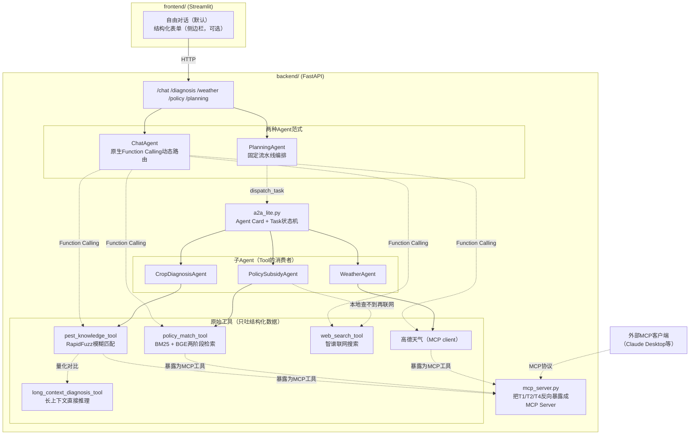

# 🌾 智慧农事助手 AgriAgent

一个面向农业场景的多Agent助手：作物病虫害诊断（支持文字描述和拍照上传）、天气与农事建议、农业补贴政策查询，并能把三者整合成一份有优先级的行动计划。

这是一个从零手写Agent框架、不依赖现成Agent库的技术验证项目，重点不是"调用了多少个API"，而是**每一层设计背后的取舍都能讲清楚为什么**——包括几次真实踩坑后的纠偏过程。完整的技术决策记录见项目开发过程中积累的笔记（工具选型、参数调优、真实bug复现与修复），这份README只呈现最终结果。

## 核心亮点

- **自建Agent框架**：`MyLLM` + `MyAgent` 完全自己实现（参考了开源Agent库的设计思路，但没有依赖它），理解Function Calling、消息拼装、重试降级这些机制在底层到底是怎么工作的，不是纯调包。
- **两种Agent范式并存，可直接对比**：`PlanningAgent` 是代码写死调用顺序的固定流水线；`ChatAgent` 是基于原生Function Calling的动态路由（模型自己判断要不要调用工具、调哪个），两者服务不同场景，不是谁取代谁。
- **借鉴A2A协议理念的轻量Agent间调度层（A2A-lite）**：`PlanningAgent`调用三个子Agent不再是裸的函数调用，而是走`core/a2a_lite.py`——每个子Agent有一张声明能力的Agent Card，每次调用产出一个有明确生命周期（submitted→working→completed/failed）的Task对象。没有实现完整的JSON-RPC协议栈（这对进程内3个子Agent的规模属于过度设计），但协议的核心设计思想（能力名片、统一消息信封、任务状态机）是真落地的，且天然带来了可观测性——为以后可视化`PlanningAgent`自己的执行轨迹留好了数据结构。
- **政策匹配是一套真正的两阶段RAG**：BM25关键词粗筛 → 地区硬过滤 → BGE中文向量语义精排 → 规则加权可解释打分，本地库覆盖不到时自动联网搜索兜底，且会明确告知用户信息来源的可信度层级（本地核实 vs 联网未核实）。
- **诊断模块两条技术路线并存，且做了量化对比实验**：主路线是RapidFuzz模糊字符串匹配（近乎零成本），另外实现了一条"长上下文直接推理"路线（把全量知识库喂给大模型自己判断），用`eval/diagnosis_retrieval_eval.py`跑一套人工标注的测试集，量化对比两者在精确匹配/近义改写/插字改写/作物过滤/真阴性五类场景下的命中率和耗时差异——选长上下文而不是GraphRAG/向量检索，是因为77条记录的知识库规模下，长上下文才是跟数据量匹配的诚实技术选择。两轮真实实测踩坑和纠偏的完整过程（插字改写匹配不上是已知边界、关键词碰撞误判靠排序过滤修复）也保留在开发笔记里；本地知识库没覆盖到时，会转而用大模型自身的通用知识给谨慎推测，并强制标注"非本地核实结果"。
- **多模态图片诊断**：上传作物照片，视觉模型（免费、不支持Function Calling）负责"看图转文字描述"，主对话模型（支持Function Calling、不支持图片）负责工具调用决策，两个免费模型分工协作，不需要引入付费的多模态模型。
- **三层防御式健壮性**：超时+限流自动重试（`MyLLM`，只对429重试）→ 单个Agent失败时优雅降级返回部分结果 → 编排层隔离某个子Agent的失败，不让它拖垮整体——每一层都在真实网络问题（429限流、超时）下被验证过确实生效，不是纸上设计。
- **前后端真正分离**：FastAPI + Streamlit 通过HTTP通信，不是同进程的"UI壳子"，可以独立部署。
- **MCP协议双向实践**：`WeatherAgent`是MCP的消费方（调用高德天气MCP Server），`mcp_server.py`反过来把诊断/天气/政策三个工具暴露成MCP Server，让别的MCP客户端也能调用——同一个项目里同时实践了协议的两端。
- **`PlanningAgent`三个子Agent并发执行**：诊断/天气/政策之间没有数据依赖，用线程池并发替代顺序调用，总耗时从三段相加降到约等于最慢的一段，有专门的耗时断言测试证明并发确实生效（不是只改了代码但实际还是顺序执行）。
- **工具调用轨迹可见**：Streamlit前端有一个默认收起的折叠面板，能直接看到`ChatAgent`这一轮实际调用了哪些工具、传了什么参数、拿到了什么原始结果，不只是看到最终的文字回答。
- **同一个Function Calling循环，手写版 vs LangGraph版对比实现**：`chat_agent_langgraph.py`用业界主流的LangGraph框架把`ChatAgent`的reason-act-observe循环重新实现了一遍，业务话术（SYSTEM_PROMPT等）直接从`chat_agent.py`导入复用，差异只发生在"循环怎么跑起来"这一层——用来对比"框架帮你做了什么、自己还剩下什么要做"（比如MemorySaver接管了记忆存取，但不会自动帮你做历史裁剪）。是一份对比学习用的旁支实现，不接入线上服务，也不影响`ChatAgent`本身。

## 架构



## 技术栈

**后端**：Python、FastAPI、Pydantic、OpenAI SDK（对接智谱GLM，OpenAI兼容接口）、MCP（既是高德天气的client，也用`mcp.server.fastmcp`把自己的工具暴露成server）、RapidFuzz、jieba、rank-bm25、sentence-transformers（BGE-small-zh-v1.5）、numpy

**前端**：Streamlit

**大模型**：智谱GLM系列（对话模型 `glm-4-flash-250414`，视觉模型 `glm-4.1v-thinking-flash`，均为免费模型）

## 项目结构

```
agri-agent/
├── backend/
│   ├── src/agri_agent/
│   │   ├── core/          # MyLLM（LLM封装+重试）、MyAgent（最小Agent基类）、a2a_lite（A2A-lite调度层）
│   │   ├── agents/         # ChatAgent（+其LangGraph对比实现）、PlanningAgent、及三个子Agent
│   │   ├── tools/          # 诊断（两条路线）/政策检索/联网搜索工具
│   │   ├── api/             # FastAPI路由
│   │   ├── models/         # Pydantic请求/响应模型
│   │   └── mcp_server.py   # 把诊断/天气/政策工具反向暴露成MCP Server
│   ├── data/                 # 病虫害知识库（77条）、政策知识库（28条），JSON格式
│   ├── eval/                 # 诊断检索方法量化对比实验（见下方"实验"部分）
│   ├── tests/                # 自动化测试（见下方"测试"部分）
│   ├── requirements.txt
│   └── requirements-langgraph.txt   # LangGraph对比实现的可选依赖，单独装
├── frontend/
│   ├── app.py
│   └── requirements.txt
├── .env.example
└── .gitignore
```

## 快速开始

### 1. 申请API Key

- 智谱AI（对话+视觉模型+联网搜索）：https://open.bigmodel.cn/ ，免费额度足够跑通本项目
- 高德开放平台（天气查询）：https://lbs.amap.com/ ，注册后创建"Web服务"类型的Key

### 2. 配置环境变量

```bash
cp .env.example .env
# 编辑 .env，把两个Key换成你自己申请到的
```

### 3. 安装依赖并启动后端

```bash
cd backend
pip install -r requirements.txt
cd src
python -m agri_agent.api.main
```

想要代码改动后自动重载，也可以在同一个目录（`backend/src`）下用：

```bash
uvicorn agri_agent.api.main:app --reload
```

注意两种方式都要求当前目录是 `backend/src`（`python -m` 要能直接找到 `agri_agent` 这个包），如果在别的目录下执行会报 `ModuleNotFoundError`。

后端默认跑在 `http://127.0.0.1:8000`，可以访问 `/docs` 看自动生成的交互式API文档。

### 4. 安装依赖并启动前端

```bash
cd frontend
pip install -r requirements.txt
streamlit run app.py
```

默认会自动打开浏览器页面，直接进入自由对话界面（结构化表单收在侧边栏，点开可用）。

### 5.（可选）把AgriAgent自己当MCP Server跑起来

除了作为HTTP服务被Streamlit调用，`backend/src/agri_agent/mcp_server.py`还能把诊断/天气/政策三个工具反向暴露成一个MCP Server，供别的MCP客户端（比如Claude Desktop）调用——这是跟第3步FastAPI服务完全独立的另一种暴露方式，两者互不冲突，不需要都启动。

```bash
python backend/src/agri_agent/mcp_server.py
```

想不接真实客户端、直接在浏览器里手动测试每个工具：

```bash
pip install "mcp[cli]"
mcp dev backend/src/agri_agent/mcp_server.py
```

会打开一个交互式Inspector页面，可以直接点开每个工具、填参数、看返回结果。

### 6.（可选）跑一下ChatAgent的LangGraph对比版本

`backend/src/agri_agent/agents/chat_agent_langgraph.py`是用[LangGraph](https://langchain-ai.github.io/langgraph/)把`ChatAgent`的reason-act-observe循环重新实现的一份旁支版本，不接入线上服务，只用来对比"业界主流框架帮你做了什么、自己还剩下什么要做"。

**务必用独立虚拟环境装它的依赖，不要装进主项目平时用的环境**——`langchain-openai`会把环境里的`openai`包静默升级到一个不兼容旧代码的大版本，如果同一个环境里还跑着别的、依赖旧版`openai`的项目（甚至可能影响本项目自己的`MyLLM`），会被搞坏。踩过这个坑的完整过程记在开发笔记第二十节。正确装法：

```bash
cd backend
python -m venv .venv-langgraph
.venv-langgraph\Scripts\activate      # Windows；Linux/Mac用 source .venv-langgraph/bin/activate
pip install -r requirements.txt
pip install -r requirements-langgraph.txt
cd src
python -m agri_agent.agents.chat_agent_langgraph
```

会跑一段内置的两轮对话演示（第二轮会引用第一轮提到的信息，验证`MemorySaver`确实接上了记忆）。这份实现和`ChatAgent`共用同一份`SYSTEM_PROMPT`等业务话术（直接从`chat_agent.py`导入，不是复制粘贴），差异只发生在"循环怎么跑起来"这一层，详细的设计对比见开发笔记。用完`deactivate`退出这个虚拟环境即可，不影响你平时的开发环境。

## 测试

```bash
cd backend
python tests/test_chat_agent_loop.py               # ChatAgent的Function Calling循环、记忆、图片描述、降级逻辑（10个场景）
python tests/test_planning_agent.py                 # PlanningAgent的编排/失败隔离/A2A-lite Task状态机逻辑
python tests/test_a2a_lite.py                        # a2a_lite.py本身：AgentCard/Message/Task/dispatch_task
python tests/test_policy_agent_fallback.py          # 政策模块本地+联网兜底的分支逻辑
python tests/test_myllm_retry.py                    # MyLLM限流自动重试逻辑
python tests/test_long_context_diagnosis_tool.py    # 长上下文诊断的JSON解析容错、越界过滤、异常兜底
python tests/test_pest_knowledge_tool.py            # 诊断模块模糊匹配的真实行为（含已知边界的回归测试）
python tests/test_policy_match_tool.py              # 政策模块两阶段检索的真实行为（含地区硬过滤回归测试）
python tests/test_chat_agent_langgraph.py           # ChatAgent的LangGraph对比实现：图路由/记忆/SystemMessage去重（需额外装requirements-langgraph.txt）
```

前六个只依赖轻量库（或者用假LLM对象做依赖注入，不需要真实网络），跑得很快；接下来两个直接用真实的RapidFuzz/BM25/BGE模型（不mock），`test_policy_match_tool.py`第一次运行会从HuggingFace下载BGE模型（几百MB），需要联网，也会慢一些，属于正常现象。最后一个（LangGraph版）需要额外`pip install -r requirements-langgraph.txt`，用假LLM对象注入，同样不需要真实网络。

## 实验：诊断模块检索方法量化对比

```bash
cd backend
python eval/diagnosis_retrieval_eval.py
```

用一套人工标注的测试集（覆盖精确匹配/近义改写/插字改写/作物不匹配/真阴性五类场景），量化对比RapidFuzz模糊匹配 vs 长上下文直接推理两条诊断检索路线的命中率和耗时，运行后会在终端打印结果，并把完整报告写到`eval/results/diagnosis_retrieval_report.md`。

这个实验需要真实网络+LLM API Key（长上下文推理每条用例都要调用一次大模型）以及真实安装的RapidFuzz，跑不了的话看`eval/results/README.md`里的说明。

**真实跑出来的结果**（16条测试用例）：

| | 整体命中率 | 平均耗时 |
|---|---|---|
| RapidFuzz模糊匹配 | 11/16（69%） | 0.1ms |
| 长上下文直接推理 | 13/16（81%） | 1058.6ms |

分类别看更有信息量：插字改写这一类（核心假设要验证的场景）RapidFuzz只有1/6，长上下文做到5/6，验证了"长上下文能扛住换种说法"这个预期；但作物不匹配这一类（专门测幻觉风险）RapidFuzz是2/2全部正确拦住，长上下文反而是0/2——两条用例都在crop不匹配的情况下，仅凭症状关键词就给出了匹配结果，说明"更灵活"是有代价的，长上下文更容易在该拒绝的时候不拒绝，这跟设计阶段预判的幻觉风险完全对上了。另外还有一条插字改写用例（番茄"叶子背面长了一层白色的霉，叶片上还有些水浸状的暗斑"，期望命中晚疫病）是RapidFuzz命中而长上下文没命中，说明长上下文也不是无脑更强，具体是哪个环节判断错了，详见`eval/results/diagnosis_retrieval_report.md`完整报告。

结论：长上下文在"应对措辞改写"这个核心场景上确实比RapidFuzz强很多，但不是无成本、无风险的全面胜出——延迟是RapidFuzz的一万倍量级，而且在"该拒绝的时候拒绝"这件事上表现不如规则匹配可靠。更合理的定位不是"用长上下文替换RapidFuzz"，而是把两条路线的分歧用例（上面列出的这几条）作为重点场景，考虑"RapidFuzz先查、查不到再用长上下文兜底复核"这种分层策略——这也是这次实验最大的价值：把"感觉长上下文应该更好"变成了一组可以指导下一步设计决策的具体数字。

## 已知局限

诚实列出目前明确知道、暂时接受的边界，而不是假装没有：

- 诊断模块的模糊匹配（RapidFuzz）能容忍"换一两个字"的近义表达，但扛不住"插入式改写"（比如"叶子有点黄"相对"叶子发黄"），这是编辑距离算法的固有边界——新加的长上下文直接推理路线理论上能解决这个问题，但代价是每次诊断都要多一次大模型调用，具体准确率提升多少、成本涨多少，见上面的量化对比实验，不是靠感觉判断。
- A2A-lite（`core/a2a_lite.py`）只借鉴了A2A协议的核心设计理念（Agent Card、统一消息信封、Task状态机），传输层仍然是进程内函数调用，不是真正的JSON-RPC/HTTP协议栈——这是刻意的取舍，不是没做完，具体理由见模块顶部注释。
- 病虫害知识库目前77条、政策知识库28条，覆盖的是常见作物和主要省份，不是穷尽性覆盖；两个模块都有"本地查不到就兜底"的设计（诊断兜底用大模型通用知识、政策兜底联网搜索），但兜底结果的可信度低于本地人工核实过的数据，代码里会明确标注。
- 图片上传目前只处理一张，多图场景还没做。
- `chat_agent_langgraph.py`（LangGraph对比实现）没有实现`ChatAgent._trim_history()`对应的历史裁剪逻辑——`MemorySaver`只负责把每轮消息存下来、下一轮取出来续上，不会像`ChatAgent`那样在超过`MAX_HISTORY_TURNS`时自动截断，也没有`MAX_TOOL_ROUNDS`等价的工具调用轮数上限。这是刻意暴露出来的"框架帮你做了什么、不帮你做什么"的对比点，不是遗漏；真要接线上服务，这两块自己实现的兜底逻辑还是免不了要补。

## Roadmap

- [ ] 对话流式输出（打字机效果）
- [ ] 把`PlanningAgent`自己的Task执行轨迹接入前端可视化（跟`ChatAgent`的工具调用轨迹面板同一个思路，`a2a_lite.py`的数据结构已经留好了口子）
- [ ] 如果长上下文对比实验证明诊断准确率提升明显，考虑给它加缓存/限流，控制多调用一次大模型带来的成本
- [ ] 如果`chat_agent_langgraph.py`要往正式使用的方向发展，需要补上历史裁剪和工具调用轮数上限（目前只是对比学习用的旁支实现，不接入线上服务）
